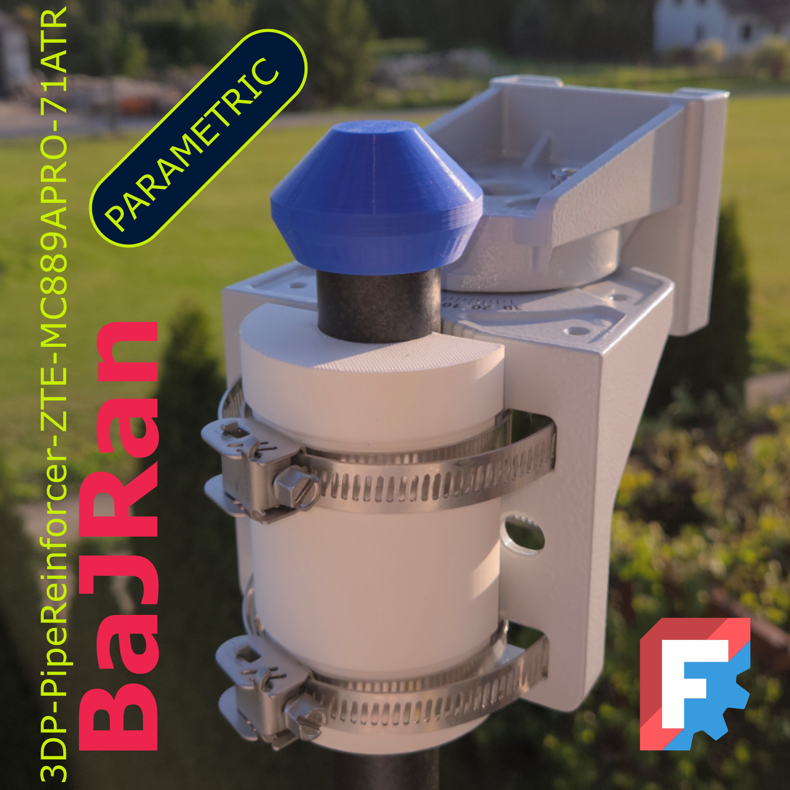

<!-- Begin README -->

    
    

    
    
    
     

> [!NOTE]
> Element designed to reinforce the antenna mounting when the base is attached to a small-diameter pipe, such as a 30 mm one. The connection can be strengthened using this component. The model allows adjusting the pipe diameter by modifying a parameter in the spreadsheet within FreeCAD.

> [!NOTE]
> **Required software:**

    

> [!NOTE]
> **Optional software:**

    

    

> [!NOTE]
> **PARAMETERS CHANGE**
> Parameters can be changes in file: 10_FreeCAD\3DP-ParametricHinge-R1C51.FCStd

    

    

<!-- VARIANTS SECTION -->
<!-- VARIANTS SECTION -->
<!-- VARIANTS SECTION -->

<!-- GALLERY SECTION -->
<!-- GALLERY SECTION -->
<!-- GALLERY SECTION -->

---

    
    

<!-- End README -->
<!-- github background #0d1117 -->